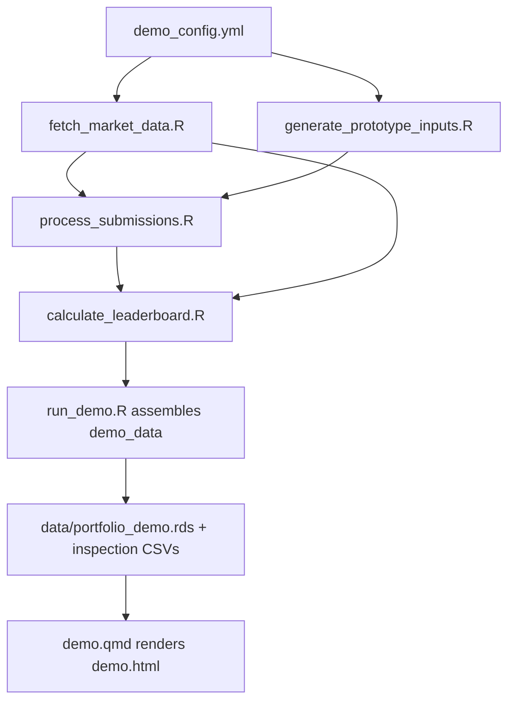

# Hedge Fund Leaderboard — Standalone Demo

[Live Demo on GitHub Pages](https://mlff-fall2026.github.io/mlff-fall2026-student-materials/Supporting/LeaderBoardDemo/LeaderBoard-Demo.html)

This folder is a **fully self-contained teaching demo** of the leaderboard
dashboard. It fabricates submission histories for five fictional funds,
downloads real Yahoo Finance prices for the trading universe, and runs both
through the same validation and performance-calculation logic used by the
real competition — all without touching the real dashboard's code or data.

## Folder contents

```text
Demo/
  demo.qmd                        Render this. Produces demo.html
  styles.css                      Copy of the shared dashboard stylesheet
  config/
    demo_config.yml                Fake trading dates, fake team roster, universe
  R/                               Demo's own copy of the calculation engine
    common.R                       Shared helpers (config loader, date math, stats)
    fetch_market_data.R            Downloads/cleans Yahoo Finance prices
    generate_prototype_inputs.R    Fabricates each fund's weekly position matrices
    process_submissions.R          Validates submissions, builds accepted history
    calculate_leaderboard.R        Positions -> returns -> risk -> rankings
    run_demo.R                     Orchestrates the five files above, end to end
  data/                            Generated on render; gitignored (see below)
```

## How a render works, step by step

`demo.qmd` sources `R/run_demo.R`, which is the entry point for the whole
pipeline. It runs the following stages in order:

1. **Load config** (`common.R::read_config()`) — reads
   `config/demo_config.yml` for the fake trading window, benchmark, ranking
   parameters (e.g. the turnover penalty $\lambda$), and the five fictional
   team names.
2. **Fetch prices** (`fetch_market_data.R::fetch_market_prices()`) — pulls
   daily adjusted close prices from Yahoo Finance (via `tidyquant`, with a
   `quantmod` fallback) for the benchmark plus the full trading universe
   (ETFs and single stocks listed in `demo_config.yml`), then builds a clean
   market panel of official trading days.
3. **Fabricate submissions** (`generate_prototype_inputs.R::generate_prototype_submissions()`) —
   for each fake fund, generates a plausible weekly sequence of portfolio
   weight snapshots (`PositionMatrix-YYYY-MM-DD-TeamName.csv` files, written
   under a temp/demo submissions tree) using hand-coded strategies per team
   (e.g. `NorthStarLong` is a long-only tilt). Some snapshots are deliberately
   made malformed or duplicated so the validation step below has something to
   catch.
4. **Validate & accept submissions** (`process_submissions.R`) — checks each
   fabricated snapshot for filename convention, weight schema, and timing
   against the submission deadline, then keeps a manifest of which snapshots
   were accepted vs. rejected and why (`submission_validation_log.csv`).
5. **Calculate the leaderboard** (`calculate_leaderboard.R`) — turns accepted
   submissions into daily positions, turnover events, and daily/weekly
   returns; computes rolling beta vs. the benchmark; and aggregates into the
   WTD/MTD/trailing-4-week/ITD summary, fund composition, return attribution,
   and operational status shown in the dashboard.
6. **Assemble & save** — `run_demo.R` bundles everything above into one list,
   `demo_data`, and writes it plus a few CSVs for manual inspection to
   `Demo/data/`.
7. **Render** — back in `demo.qmd`, `x <- demo_data` unpacks that list and the
   rest of the `.qmd` builds the tables/plots shown in the dashboard tabs.



## What lands in `data/` (gitignored, regenerated every render)

| File | What it is |
|---|---|
| `portfolio_demo.rds` | The full `demo_data` list consumed by `demo.qmd` (positions, returns, summaries, attribution, etc.) |
| `current_team_summary.csv` | Leaderboard summary table (one row per fund, as of the last trading day) |
| `current_operational_status.csv` | Per-fund submission health (accepted/rejected counts, last accepted date, etc.) |
| `submission_validation_log.csv` | Every fabricated snapshot with its accept/reject status and reason |
| `turnover_events.csv` | Individual position changes detected between consecutive accepted submissions |
| `weekly_turnover.csv` | Turnover aggregated to weekly, per fund |
| `submissions/` | The raw fabricated `PositionMatrix-*.csv` files, organized by team/date/version |

## Running it

```bash
quarto render Supporting/LeaderBoardDemo/demo.qmd
```

Every render re-fetches Yahoo Finance data and re-fabricates the fake
submission history from scratch (using the seed in `demo_config.yml` for
reproducibility of the fabricated weights), then re-runs the full validation
and calculation pipeline. This means each render requires network access and
takes noticeably longer than reading a cached file — there is no cached
short-circuit by design, so the demo always reflects the current `R/` code.

## Why a full copy instead of sharing code with the real dashboard's `R/`?

The real dashboard (`../../Topics/LeaderBoard/index.qmd`,
`../../Topics/LeaderBoard/R/`, `../../Topics/LeaderBoard/config/teams.yml`)
will change as real-portfolio ingestion is built out this semester.
Duplicating the small set of calculation scripts here means:

- this demo keeps working, unchanged, no matter what happens to the real
  pipeline;
- rendering this demo can never overwrite or otherwise affect the real
  dashboard's cached data;
- you can hand this folder to students (or archive it) as a single,
  independent artifact.

The tradeoff: a bug fix made in `../R/calculate_leaderboard.R` will not
automatically apply here. That's intentional — this is a frozen teaching
snapshot, not a live-tracking mirror. If you want to pull in a later fix,
copy the relevant file(s) from `../R/` into `Demo/R/` and re-test.
